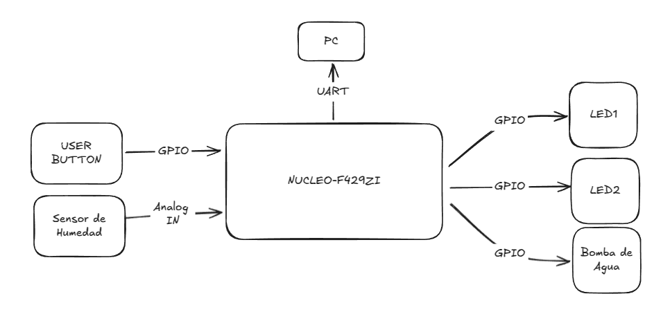
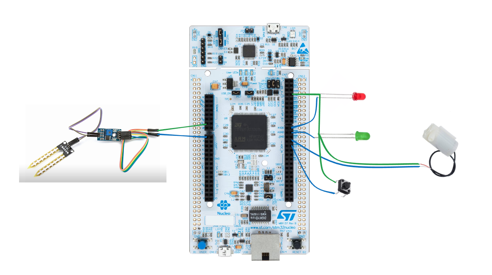

# Sistemas Embebidos - TP1
## Título: Sistema de Riego Automático
## Alumno: Julián Stejman

### Descripción:
El sistema debe monitorear la humedad del suelo mediante un sensor analógico y activar el riego cuando el nivel de humedad esté por debajo de un umbral predefinido.

Si el usuario pulsa un botón, el sistema activa el riego manualmente, independiente del nivel de humedad. Mientras el botón esté pulsado, el riego continúa.

La medición de la humedad se realiza mediante un sensor de humedad como [éste](https://articulo.mercadolibre.com.ar/MLA-912019500-modulo-sensor-de-humedad-de-suelo-tierra-higrometro-arduino-_JM?matt_tool=27348800&matt_word=&matt_source=google&matt_campaign_id=22107887484&matt_ad_group_id=173357593636&matt_match_type=&matt_network=g&matt_device=c&matt_creative=729634821107&matt_keyword=&matt_ad_position=&matt_ad_type=pla&matt_merchant_id=546301794&matt_product_id=MLA912019500&matt_product_partition_id=2394343693421&matt_target_id=pla-2394343693421&cq_src=google_ads&cq_cmp=22107887484&cq_net=g&cq_plt=gp&cq_med=pla&gad_source=1&gclid=CjwKCAjwnPS-BhBxEiwAZjMF0majQV8Qc0__Ft71JBLiJaX5zt01v3b3AZPCyNBwX2q637RYmr514hoCKrgQAvD_BwE).

Para indicar que el sistema está regando, se enciende un LED.

Cada segundo se enciende y apaga un LED indicando que el sistema está activo. Se envía a través del puerto serie un resumen del estado del sistema:
- Estado del riego (activo / inactivo)
- Lectura del botón (presionado /no presionado)
- Nivel de humedad actual
- Tiempo hasta la próxima medición de humedad

### Plataforma de desarrollo: 
NUCLEO-F429ZI
### Periféricos a utilizar

 - USER BUTTON: Fuerza el riego manual mientras se lo sostiene presionado.
 - LED 1: Se encenderá para indicar que el sistema está regando.
 - LED 2: Se enciende y apaga cada un segundo para indicar que el sistema está activo.
 - ANALOG IN 1: Se utiliza para leer el nivel de humedad del suelo mediante un sensor analógico.
 - UART: Se utiliza para enviar información de estado del sistema a la PC.
 - Bomba de agua: Mueve agua de un recipiente a otro lado a través de una manguera. 

### Descripción de código
#### 1. Monitoreo de Humedad: 
- Lee un sensor analógico de humedad y guarda el valor. 
- Compara la humedad con un umbral predefinido.
- Si el sustrato está seco activa una bomba de agua.
#### 2. Riego manual con botón:
- Usa el botón para activar el riego manualmente.
- Mientras se aprieta el botón:
  - La bomba se enciende 
  - Un LED de riego se activa
#### 3. Indicadores Visuales:
- LED de riego: Se enciende cuando el sistema riega
- LED de sistema activo: Parpadea cada segundo para indicar que el sistema está en ejecución.
#### 4. Comunicación Serial (UART)
 - Cada segundo, envía por UART un reporte con:
    - Estado de riego
    - Valor de humedad actual

### Documentación para los códigos fuente
Se incluye una página de documentación en [este](https://jstejman.github.io/SE-TP1/html/index.html) enlace con explicaciones sobre las funciones utilizadas.    

### Video
En [este](https://www.youtube.com/watch?v=121yWFNWNIY) enlace está un video explicando el desarrollo del trabajo

### Diagrama en bloques:

### Diagrama de placa:

